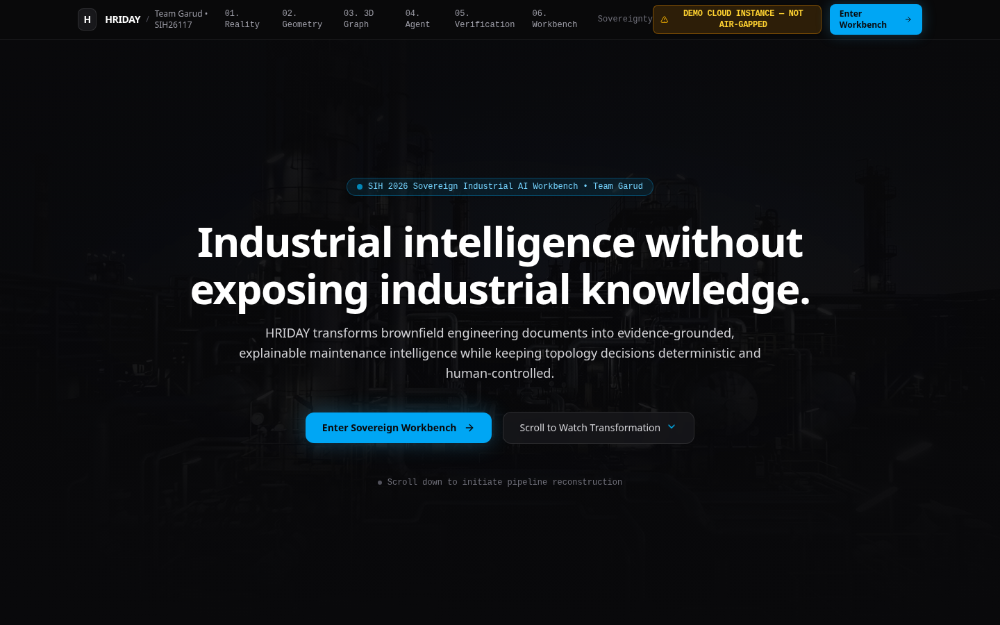
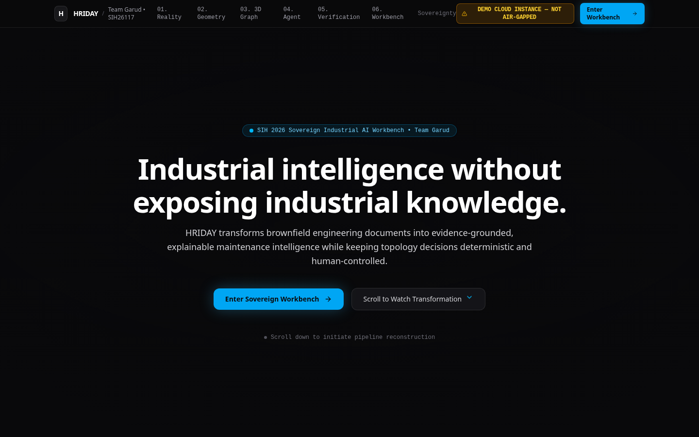

# HRIDAY Frontend — Sovereign Industrial AI Workbench

<p align="center">
  <a href="https://frontend-swart-five-99.vercel.app"></a>
  
  
  
  
  
</p>

HRIDAY is a **Sovereign Industrial AI Workbench** for Smart India Hackathon (Problem Statement ID: SIH26117). The product is designed as a local-first multimodal workbench for confidential industrial knowledge work, with deterministic Brownfield P&ID and maintenance intelligence as a flagship specialist capability.

🔗 **Live Production Application:** [https://frontend-swart-five-99.vercel.app](https://frontend-swart-five-99.vercel.app)

---

## 📸 Interface Showcase

| Industrial Engineering Workbench (`#workbench`) | Product Story & Mission Architecture |
| :---: | :---: |
|  |  |

---

## Experience

The frontend has two layers:

- **Product story** — explains the problem, architecture, engineering truth boundary, evidence model and sovereignty posture.
- **Workbench** — a contextual operator surface where conversation is the primary control plane and specialist workspaces provide visual evidence.

### Workspaces

Engineering · P&ID · Topology · Documents · Data · Evidence · Verification · Isolation · Artifact

The workbench follows a judge-friendly investigation path: **Mission → Reason → P&ID → Graph → Evidence → Verify → Isolation → Deliver**. Agent tasks can route into the relevant specialist workspace, while users can also navigate directly through the workflow.

The P&ID and topology surfaces provide interactive demo inspection: pan/zoom/fit, selectable assets, uncertainty visibility, deterministic graph layouts, path highlighting and read-only inspectors. Verification is an explicit human gate; isolation is decision support only.

## Safety and truth boundary

The frontend must not imply that synthetic demo data is live engineering output. The LLM is an untrusted planner/reasoner; structured engineering services remain authoritative for topology and engineering facts. HRIDAY is read-only decision support and does not actuate industrial controls.

A cloud preview is explicitly labelled **DEMO CLOUD INSTANCE — NOT AIR-GAPPED**. Physical/network air-gapping is an infrastructure control, not something the frontend can certify.

## Adapter configuration

The default mode is `demo`.

```bash
VITE_HRIDAY_ADAPTER_MODE=demo
```

Set `VITE_HRIDAY_ADAPTER_MODE=backend` only when the real HRIDAY backend API contract has been verified and implemented in `src/adapters/backend/backendAdapter.ts`. There is intentionally no automatic fallback from backend mode to demo data.

## Development

```bash
npm install
npm run dev
```

Verification workflow:

```bash
npm ci
npx tsc --noEmit
npm run build
```

GitHub Actions runs the same typecheck/build verification on pushes and pull requests targeting `main`.

## Current integration status

The workbench is currently a frontend demo layer. Its P&ID, topology, evidence and artifact surfaces use explicit synthetic/demo data. Production backend wiring is intentionally blocked until the backend exposes a stable, verified contract.
